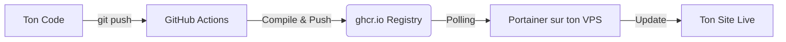

# Guide Déploiement Portainer (Méthode Réutilisable)

Ce guide explique comment déployer un projet Docker sur ton VPS via Portainer avec une automatisation via GitHub Actions.

## 🟢 Schéma simple : Comment ça marche ?

1.  **GitHub Actions** s'occupe de la "fabrication" : Il transforme ton code en images Docker et les range sur GitHub (`ghcr.io`).
2.  **Portainer** s'occupe de la "surveillance" : Toutes les 5 minutes, il regarde sur GitHub s'il y a une nouvelle image. S'il en voit une, il la télécharge et redémarre ton site.

---

## 1. Configuration initiale (Une seule fois par VPS)

### Créer le réseau partagé (Network)
Certains projets utilisent un réseau externe pour communiquer avec un reverse-proxy.
Dans Portainer : **Networks > Add network**.
*   **Name** : `proxy-network`
*   **Driver** : `bridge`

### Ajouter le Registry GitHub
Dans Portainer : **Settings > Registries > Add Registry > Custom Registry**.
*   **Name** : `GitHub Registry`
*   **Registry URL** : `ghcr.io`
*   **Username** : `harelmarin`
*   **Password / PAT** : Ton Personal Access Token GitHub (`ghp_...`).

---

## 2. Déploiement du Projet (Par projet)

### Créer la Stack (Mode GitOps)
Dans Portainer : **Stacks > Add stack**.
1.  **Nom** : `kickr`.
2.  **Build method** : Choisir **Repository**.
3.  **Repository URL** : `https://github.com/harelmarin/kickr`.
4.  **Compose path** : `docker-compose.prod.yml`.
5.  **GitOps updates** : Activer **ON**, Mechanism **Polling**, Interval **5m**.
6.  **Variables d'environnement** : Cliquer sur **Advanced mode** et copier le `.env`.
7.  **Authentication** : Activer **ON** et remettre ton pseudo + PAT GitHub.

## 3. Configuration de Nginx Proxy Manager (NPM)

Une fois NPM installé sur `http://46.224.219.155:81` :
1.  **Proxy Hosts** : Ajoute un host pour chaque domaine.
    - **Host 1** : `kickrhq.com` -> `kickr-client` port `80`.
    - **Host 2** : `api.kickrhq.com` -> `kickr-server` port `8080`.
2.  **SSL** : Dans l'onglet SSL, coche **Request a new SSL Certificate** et **Force SSL**.
